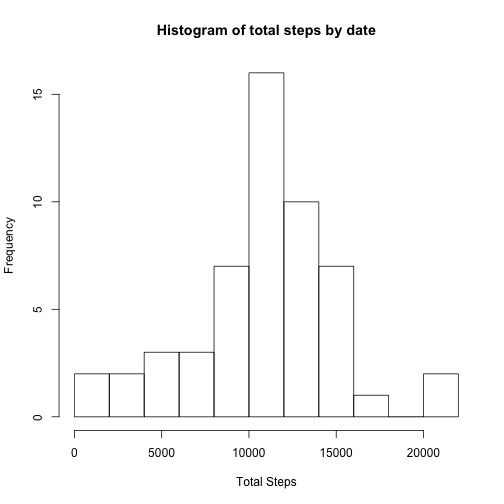
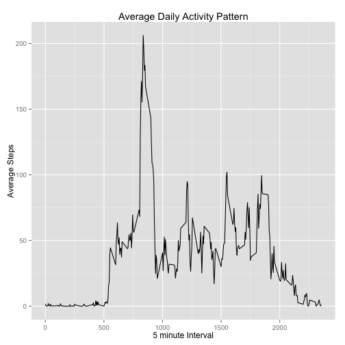
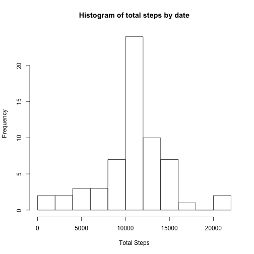
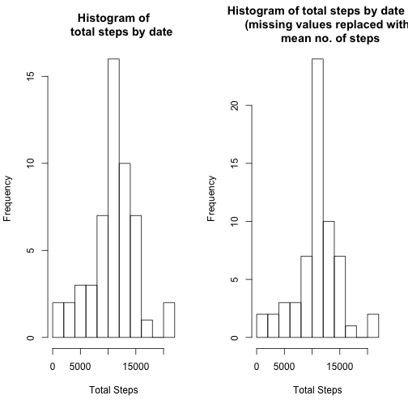
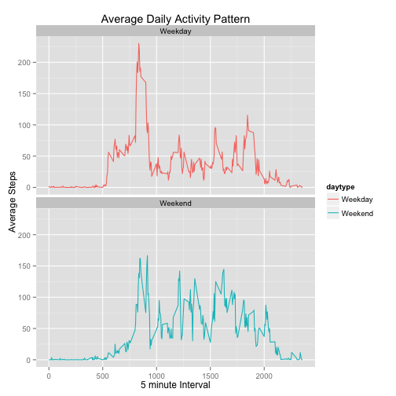

## Introduction
This assignment makes use of data from a personal activity monitoring device. This device collects data at 5 minute intervals through out the day. The data consists of two months of data from an anonymous individual collected during the months of October and November, 2012 and include the number of steps taken in 5 minute intervals each day.

## Loading Libraries & Setting default echo


```r
library(knitr)
library(dplyr)
library(ggplot2)
opts_chunk$set(echo = TRUE)
```

## Checking current work directory and checking if the file exists or not, if not then downloading the file


```r
wrkdir <- getwd()
if(!file.exists("Activitymon.zip"))
{
  fileurl <- "https://d396qusza40orc.cloudfront.net/repdata%2Fdata%2Factivity.zip"
  download.file(fileurl,destfile="Activitymon.zip",method="curl")
}
```

## Unzipping the file

```r
unzip(zipfile="Activitymon.zip")
##wd <- file.path(wrkdir,"RepResProj1")
##setwd(wd)
```

## Loading the Data and creating a data frame


```r
df_actmon <- read.csv(file="activity.csv",header= TRUE)
```

## Tidying the data and checking overall structure of the data frame
Converting the factor type to a date type


```r
df_actmon$date <- as.Date(df_actmon$date)
str(df_actmon)
```

```
## 'data.frame':	17568 obs. of  3 variables:
##  $ steps   : int  NA NA NA NA NA NA NA NA NA NA ...
##  $ date    : Date, format: "2012-10-01" "2012-10-01" ...
##  $ interval: int  0 5 10 15 20 25 30 35 40 45 ...
```

```r
head(df_actmon)
```

```
##   steps       date interval
## 1    NA 2012-10-01        0
## 2    NA 2012-10-01        5
## 3    NA 2012-10-01       10
## 4    NA 2012-10-01       15
## 5    NA 2012-10-01       20
## 6    NA 2012-10-01       25
```

Removing NA's and assigning the clean data to the data frame


```r
df_actmon_cln <- na.omit(df_actmon)
```

The data is now tidy and can be used for further analysis

##  What is mean total number of steps taken per day?
- For this part of the assignment missing values will be ignored
- Make a histogram of the total number of steps taken each day
- Calculate and report the mean and median total number of steps taken per day

First we group the data by date using dplyr - group_by function

```r
by_date <- group_by(df_actmon_cln,date)
```

Then we use summarise function to get the total no. of steps by date

```r
df_totsteps_bydt <- summarise(by_date,total=sum(steps))
head(df_totsteps_bydt)
```

```
## Source: local data frame [6 x 2]
## 
##         date total
##       (date) (int)
## 1 2012-10-02   126
## 2 2012-10-03 11352
## 3 2012-10-04 12116
## 4 2012-10-05 13294
## 5 2012-10-06 15420
## 6 2012-10-07 11015
```

Now we can generate a histogram using the hist function

```r
hist(df_totsteps_bydt$total,10,freq = T,main="Histogram of total steps by date",xlab="Total Steps")
```

 

The mean and median of the total no. of steps taken per day is as follows

```r
mean(df_totsteps_bydt$total)
```

```
## [1] 10766.19
```

```r
median(df_totsteps_bydt$total)
```

```
## [1] 10765
```

## What is the average daily activity pattern?
- Make a time series plot (i.e. type = "l") of the 5-minute interval (x-axis) and the 
  average number of steps taken, averaged across all days (y-axis)
- Which 5-minute interval, on average across all the days in the dataset, contains the  
  maximum number of steps?

First we group the data by interval using the group_by package in the dplyr library

```r
by_int <- group_by(df_actmon_cln,interval)
```

Then using the summarise function we find out the total no. of steps by interval


```r
df_totsteps_bydtint <- summarise(by_int,total=mean(steps))
head(df_totsteps_bydtint)
```

```
## Source: local data frame [6 x 2]
## 
##   interval     total
##      (int)     (dbl)
## 1        0 1.7169811
## 2        5 0.3396226
## 3       10 0.1320755
## 4       15 0.1509434
## 5       20 0.0754717
## 6       25 2.0943396
```

Using the ggplot function we can depict the time series plot

```r
ggplot(df_totsteps_bydtint,aes(interval,total)) + geom_line() + xlab("") + 
 ylab("Average Steps") + xlab("5 minute Interval") + ggtitle("Average Daily Activity Pattern") + scale_x_continuous(breaks=c(seq(0,2500,by=500)))
```

 

The 5 minute interval across all days that contains the maximum no. of steps is 


```r
filter(df_totsteps_bydtint,total == max(df_totsteps_bydtint$total))
```

```
## Source: local data frame [1 x 2]
## 
##   interval    total
##      (int)    (dbl)
## 1      835 206.1698
```

## Inputing missing values
- Note that there are a number of days/intervals where there are missing values (coded  
  as NA). The presence of missing days may introduce bias into some calculations or  
  summaries of the data.
- Calculate and report the total number of missing values in the dataset (i.e. the total   number of rows with NAs)
- Devise a strategy for filling in all of the missing values in the dataset. The  
  strategy does not need to be sophisticated. For example, you could use the mean/median   for that day, or the mean for that 5-minute interval, etc.
- Create a new dataset that is equal to the original dataset but with the missing data 
  filled in.
- Make a histogram of the total number of steps taken each day and Calculate and report 
  the mean and median total number of steps taken per day. Do these values differ from 
  the estimates from the first part of the assignment? What is the impact of imputing 
  missing data on the estimates of the total daily number of steps?
  
  
The total no. of records with missing values are

```r
sum(is.na(df_actmon))
```

```
## [1] 2304
```

For filing up all the NA values we will first create a new data frame 

```r
df_actmon_upd <- df_actmon
```

Using tapply function we will get the mean no. of steps grouping by interval for non NA records

```r
actmon_avgint <- tapply(df_actmon_upd$steps, df_actmon_upd$interval, mean, na.rm=TRUE)
```

Finally we will update the missing value with the mean no. of steps in the new dataset

```r
df_actmon_upd$steps[is.na(df_actmon_upd$steps)] <- actmon_avgint[as.character(df_actmon_upd$interval[is.na(df_actmon_upd$steps)])]
```
Checking to see if there are any more NA values

```r
sum(is.na(df_actmon_upd))
```

```
## [1] 0
```
First we group the data by date using the group_by package in the dplyr library

```r
by_dt <- group_by(df_actmon_upd,date)
```
We use the summarise function and calculate the total no. of steps by date

```r
df_totalsteps_bydt <- summarise(by_dt,total=sum(steps))
head(df_totalsteps_bydt)
```

```
## Source: local data frame [6 x 2]
## 
##         date    total
##       (date)    (dbl)
## 1 2012-10-01 10766.19
## 2 2012-10-02   126.00
## 3 2012-10-03 11352.00
## 4 2012-10-04 12116.00
## 5 2012-10-05 13294.00
## 6 2012-10-06 15420.00
```
Finally we generate the histogram using the updated data set and comparing with the older histogram

```r
hist(df_totalsteps_bydt$total,10,freq = T,main="Histogram of total steps by date",xlab="Total Steps")
```

 

```r
par(mfrow=c(1,2))
par(mfrow=c(1,2))
hist(df_totsteps_bydt$total,10,freq = T,main="Histogram of
     total steps by date",xlab="Total Steps")
hist(df_totalsteps_bydt$total,10,freq = T,main="Histogram of total steps by date 
      (missing values replaced with
        mean no. of steps",xlab="Total Steps")
```

 

The mean and median of the total no. of steps taken per day (with missing values replaced) is

```r
mean(df_totalsteps_bydt$total)
```

```
## [1] 10766.19
```

```r
median(df_totalsteps_bydt$total)
```

```
## [1] 10766.19
```
The impact of replacing missing data is minimal as only the median changed

```r
mean(df_totsteps_bydt$total) - mean(df_totalsteps_bydt$total)
```

```
## [1] 0
```

```r
median(df_totalsteps_bydt$total) - median(df_totsteps_bydt$total)
```

```
## [1] 1.188679
```
## Are there differences in activity patterns between weekdays and weekends?
For this part the weekdays() function may be of some help here. Use the dataset with the filled-in missing values for this part.
- Create a new factor variable in the dataset with two levels – “weekday” and “weekend” 
  indicating whether a given date is a weekday or weekend day.
- Make a panel plot containing a time series plot (i.e. type = "l") of the 5-minute 
  interval (x-axis) and the average number of steps taken, averaged across all weekday 
  days or weekend days (y-axis). See the README file in the GitHub repository to see an 
  example of what this plot should look like using simulated data.

Using the same data set with the missing values updated we will add a new column to the dataframe by using the mutate function, this new column will be day type (weekday/weekend)

```r
df_actmon_upd <- mutate(df_actmon_upd, daytype = ifelse(weekdays(df_actmon_upd$date) == "Saturday" | weekdays(df_actmon_upd$date) == "Sunday"  , "Weekend" , "Weekday"))
```
Grouping data by interval and daytype using the group_by function in the dplyr package

```r
by_weektyp_int <- group_by(df_actmon_upd,interval,daytype)
```
Using the summarise function to calculate mean no. of steps

```r
df_totsteps_byweektypint <- summarise(by_weektyp_int,total=mean(steps))
```
Finally generating the plot 

```r
ggplot(df_totsteps_byweektypint,aes(interval,total,color = daytype)) + geom_line() + xlab("") + ylab("Average Steps") + xlab("5 minute Interval") + ggtitle("Average Daily Activity Pattern") + scale_x_continuous(breaks=c(seq(0,2500,by=500))) + facet_wrap(~daytype, ncol = 1, nrow=2)
```

 

From the above two plots we can see the test person is more active on a weekday rather than on a weekend.
